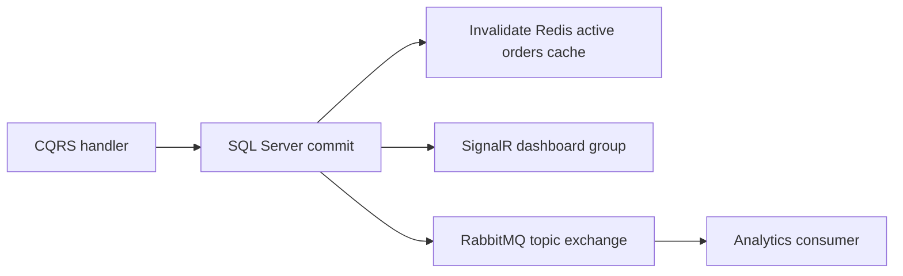

# Architecture

## Dependency rule

The solution follows Clean Architecture. Dependencies point inward:

```text
API -> Application -> Domain
API -> Infrastructure -> Application
Infrastructure -> Domain
```

- **Domain** owns entities, value objects, state transitions and business exceptions. It has no external package dependency.
- **Application** defines use-case, persistence, cache, messaging and realtime ports.
- **Infrastructure** implements persistence with EF Core and SQL Server, Redis cache adapters and RabbitMQ event adapters.
- **API** is the composition root, hosts SignalR and translates failures into standard Problem Details responses.

## Consistency

`Order` and `Driver` use SQL Server `rowversion` columns. Update commands carry the version returned by the API. Stale versions and EF Core concurrency races return HTTP 409.

All domain dates are represented as `DateTimeOffset` and normalized to UTC at entity boundaries.

## Persistence

The initial migration creates Orders, OrderItems, Drivers and DriverAssignments with foreign keys and indexes for the primary query paths. The generated idempotent SQL script is stored under `scripts/database`.

Driver coordinates are represented by a validated domain value object and persisted as latitude/longitude columns. Infrastructure synchronizes an additional SQL Server `geography` point and the migration creates a spatial index for nearest-driver queries.

## Realtime flow

Write use cases publish changes through Application ports after the database commit succeeds:



SignalR lives in the API layer behind `ITrackingNotifier`, so Application remains framework-agnostic. RabbitMQ events use a durable topic exchange named `order-tracking.events`; the in-process analytics consumer binds to `*.changed` as a stepping stone toward separate notification/analytics services.

Redis caches active-order pages for short intervals and invalidates by incrementing a version key. If Redis or RabbitMQ are disabled, no-op adapters keep the local development path fast and predictable.

## Simulation

`DriverMovementSimulator` is a hosted service that periodically moves non-offline drivers by a small random delta, commits the new coordinates and broadcasts `driver.location.changed`. It is controlled by `DriverMovementSimulator` configuration and is meant for demos and load-test scenarios, not production dispatch logic.

## Decisions deferred to later phases

- Transactional outbox and idempotent external consumers.
- React dashboard.
- Integration, E2E and load tests.
- Containers, Kubernetes and observability stack.
